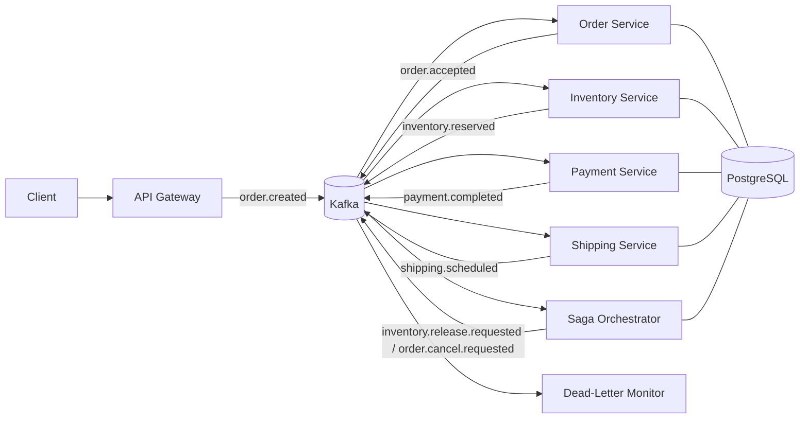

# Event-Driven Order Processing Platform

A production-ready reference architecture for distributed order management with Kafka, PostgreSQL, Saga compensation, and Prometheus/Grafana observability.

The platform is intentionally event-driven: services communicate by publishing and consuming Kafka events, not by making direct service-to-service HTTP calls. This keeps the order pipeline loosely coupled, replayable, and resilient to partial failures.

## Architecture



### Happy path

1. `api-gateway` authenticates and rate-limits a request, then publishes `order.created`.
2. `order-service` persists the order and publishes `order.accepted`.
3. `inventory-service` reserves stock and publishes `inventory.reserved`.
4. `payment-service` charges the customer idempotently and publishes `payment.completed`.
5. `shipping-service` schedules fulfillment and publishes `shipping.scheduled`.
6. `order-service` marks the order as `COMPLETED`.

### Compensation path

When payment fails, the `saga-orchestrator` publishes:

- `inventory.release.requested` so reserved stock is released.
- `order.cancel.requested` so the order is cancelled.

Saga progress is persisted in PostgreSQL, making compensation resumable after orchestrator restarts.

## Design decisions

- **Kafka-first service boundaries:** every domain transition is represented as an event, enabling replay, auditability, and independent scaling.
- **Choreography with compensation orchestration:** services drive the happy path through events; the Saga Orchestrator only coordinates rollback flows.
- **Idempotent consumers:** every service records processed event IDs in PostgreSQL before committing Kafka offsets.
- **Payment idempotency keys:** payment attempts use a unique key derived from `order_id + attempt_number` to prevent double-charging.
- **Dead-letter topics:** poison-pill messages are retried three times with exponential backoff, then routed to `orders.dlq`.
- **Trace propagation:** W3C trace context headers are carried across Kafka messages for end-to-end async traces.
- **Lag-based autoscaling:** Kubernetes manifests include KEDA Kafka scalers, which drive HPA behavior from consumer group lag.

## Repository layout

```text
order_platform/
  common/                 Shared Kafka, DB, event, metric, and tracing helpers
  services/
    api_gateway/          HTTP ingress that publishes order.created
    order_service/        Order state machine
    inventory_service/    Stock reservation and release
    payment_service/      Idempotent payment processing
    shipping_service/     Fulfillment scheduling
    saga_orchestrator/    Compensation coordinator
    dlq_monitor/          DLQ visibility and alert metrics
  sql/schema.sql          PostgreSQL schema and seed inventory
docker-compose.yml        Local Kafka/PostgreSQL/Grafana stack
k8s/                      Kubernetes deployments and KEDA scalers
tests/                    Focused pure unit tests
```

## Quick start

```bash
cp .env.example .env
docker compose up --build
```

Then create an order:

```bash
curl -X POST http://localhost:8000/orders \
  -H "content-type: application/json" \
  -H "authorization: Bearer local-dev-token" \
  -d '{
    "customer_id": "customer-123",
    "items": [{"sku": "SKU-RED-CHAIR", "quantity": 1, "unit_price_cents": 4999}],
    "payment_method_id": "pm_demo"
  }'
```

Service ports:

| Service | Port |
| --- | --- |
| API Gateway | `8000` |
| Order Service metrics | `8010` |
| Inventory Service metrics | `8020` |
| Payment Service metrics | `8030` |
| Shipping Service metrics | `8040` |
| Saga Orchestrator metrics | `8050` |
| DLQ Monitor metrics | `8060` |
| Prometheus | `9090` |
| Grafana | `3000` |

## Operational notes

- Kafka topics are created by the `topic-init` container.
- PostgreSQL schema is initialized from `order_platform/sql/schema.sql`.
- The local payment adapter deliberately fails payment methods that start with `fail_` to exercise compensation.
- DLQ failures increment Prometheus counters and are retained in PostgreSQL for later replay workflows.

## Interview-ready answers

**Why Kafka and not RabbitMQ?** Kafka keeps an append-only log, so consumers can replay from any offset for debugging, backfills, or new downstream services. RabbitMQ usually removes messages after acknowledgement.

**How do you prevent double-charging?** The Payment service inserts a unique `payment_idempotency_key` before charging. Replayed events hit the unique constraint and return the stored result instead of calling the processor again.

**What happens if the Saga Orchestrator crashes mid-compensation?** Compensation state is persisted after each command. On restart, the orchestrator resumes from PostgreSQL and republishes only missing idempotent commands.

**How is this different from a monolith with one database transaction?** Independent services own independent data. Saga compensation provides eventual consistency across those boundaries without distributed locks or two-phase commit.